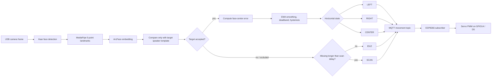

# Face Locking Recognition System

A real-time single-speaker face recognition project for enrolling an authorized presenter, recognizing only that target from a camera, logging evidence, and steering an ESP8266 servo camera over MQTT.

The project is CPU-first. It works with the normal `onnxruntime` package, so people without GPUs do not need CUDA, cuDNN, or `onnxruntime-gpu`.

## Project Layout

- `src/enroll.py` - capture face samples and build the face database.
- `src/recognize.py` - run local face recognition and face locking.
- `src/rebuild_db.py` - rebuild `data/db/face_db.npz` from existing enrollment crops.
- `addons/mqtt_servo_tracking/recognize_mqtt.py` - face locking plus MQTT movement/status publishing.
- `addons/mqtt_servo_tracking/esp8266/face_tracker_servo/face_tracker_servo.ino` - ESP8266 servo firmware.
- `dashboard/index.html` - static MQTT dashboard for live movement and lock status.
- `logs/` - action history files and structured JSONL evidence created during face-lock sessions.

## Requirements

Use Python 3.10, 3.11, 3.12, or 3.13. Python 3.14 is not recommended because some computer-vision packages may not have wheels for it yet.

Install dependencies from the repo root:

```bash
pip install -r requirements.txt
```

The included requirements use:

```text
onnxruntime
```

That is the CPU ONNX Runtime package. If only CPU ONNX Runtime is installed, the recognizer automatically uses `CPUExecutionProvider`.

Required model files:

- `models/embedder_arcface.onnx`
- `models/face_landmarker.task`

## Quick Start

1. Install dependencies:

   ```bash
   pip install -r requirements.txt
   ```

2. Put the required model files in `models/`.

3. Enroll a person:

   ```bash
   python -m src.enroll
   ```

   Controls:

   - `SPACE` - capture one sample.
   - `a` - toggle auto-capture.
   - `s` - save enrollment to the database.
   - `q` - quit.

4. Rebuild the database if you already have crops in `data/enroll/`:

   ```bash
   python -m src.rebuild_db
   ```

5. Run local recognition:

   ```bash
   python -m src.recognize --target-name albert
   ```

   Controls:

   - `+` or `=` - increase the recognition distance threshold.
   - `-` - decrease the threshold.
   - `r` - reload the face database.
   - `d` - toggle debug overlay.
   - `l` - lock or unlock the selected recognized face.
   - `q` - quit.

## CPU And GPU Notes

For CPU-only users, keep `onnxruntime` in `requirements.txt`. No separate CPU-only Python files are needed.

When the app starts, it checks ONNX Runtime providers. If only CPU is available, it selects CPU automatically. If GPU-capable ONNX Runtime packages are installed, it prompts for a provider and keeps CPU as a fallback.

Optional GPU setups:

- NVIDIA CUDA: use `onnxruntime-gpu` in a GPU-specific environment.
- Windows DirectML: use `onnxruntime-directml` in a GPU-specific environment.

Avoid installing multiple ONNX Runtime variants into the same environment unless you know they are compatible.

## Face Locking

During recognition, press `l` when a known face is selected. The app locks onto that identity, tracks movement, and records actions such as:

- Face locked or unlocked.
- Head moved left or right.
- Smile or blink events detected from landmarks.
- Face temporarily lost or reacquired.

History files are written to `logs/` as:

```text
[Name]_history_[timestamp].txt
```

Example line:

```text
2026-01-31 13:20:20.225528 - HEAD_RIGHT: Moved right by 31.9px
```

## MQTT Servo Addon

The MQTT addon keeps the original recognizer separate and publishes servo commands for the ESP8266. It is configured for a single authorized speaker with `--target-name`; other enrolled identities remain in the database for testing but are ignored during the live tracking run.

Run it from the repo root:

```bash
python addons/mqtt_servo_tracking/recognize_mqtt.py
```

Default MQTT settings:

- Broker: `albertserver`
- MQTT port: `1883`
- Browser WebSocket URL: `wss://broker.hivemq.com:8884/mqtt`
-- Movement topic: `vision/albert/ne/movement`
-- Status topic: `vision/albert/ne/status`

Movement payloads on `vision/albert/ne/movement`:

- `LEFT` - locked face is left of frame center.
- `RIGHT` - locked face is right of frame center.
- `CENTER` - locked face is centered; the servo holds its current angle.
- `SCAN` - locked face is missing, sweep the servo to reacquire the target.
- `IDLE` - no active face lock.

The firmware also accepts `HOME` for manual recentering; the Python tracker does not publish it automatically.

Dashboard JSON is published on `vision/albert/ne/status`, including movement, lock state, target name, face count, confidence, distance, raw and smoothed horizontal error, center-zone/deadzone values, FPS, timing, threshold, provider, resolution, and MQTT health.

Useful addon flags:

   ```bash
   python addons/mqtt_servo_tracking/recognize_mqtt.py --target-name albert --mqtt-broker albertserver --mqtt-topic vision/albert/ne/movement --mqtt-status-topic vision/albert/ne/status --camera-width 960 --camera-height 540 --max-faces 5 --locked-max-faces 5 --detect-every 2 --recognize-every 3 --landmark-roi-width 224 --deadzone-px 70 --center-zone-ratio 0.36 --center-exit-hysteresis-px 45 --command-hold-sec 0.25 --scan-delay-sec 0.8 --reacquire-hold-sec 0.30 --command-confirm-frames 2 --mqtt-min-interval 0.15 --mqtt-status-min-interval 0.25
   ```

## Recognize To Command Flow



While locked, the tracker still detects multiple faces and runs recognition on each candidate. Only the configured `--target-name` can produce a valid lock or movement command, so audience members and co-presenters are treated as non-target faces.

## Evidence Logging

The MQTT tracker writes structured operational evidence by default to:

```text
logs/evidence/face_tracking_evidence_[timestamp].jsonl
```

Each JSONL record includes:

- Target speaker name.
- Timestamp and sequence number.
- All detected face boxes and recognition results.
- Target confidence (`confidence` / cosine similarity) and distance.
- Lock state and target reacquisition state.
- Horizontal error in pixels.
- Published motor command: `LEFT`, `RIGHT`, `CENTER`, `SCAN`, or `IDLE`.
- MQTT publish result for movement and status messages.

Use `--disable-evidence-log` only for informal testing. For assessment evidence, keep it enabled and submit the JSONL file together with the action history files in `logs/`.

## Dashboard

Open:

```text
dashboard/index.html
```

The dashboard is a static HTML file. It uses MQTT over WebSockets and defaults to:

```text
wss://broker.hivemq.com:8884/mqtt
```

It listens to:

- `vision/albert/ne/movement`
- `vision/albert/ne/status`

The JSON status topic is authoritative for the displayed command. The raw movement topic is used only as a fallback if status messages stop arriving, which prevents delayed MQTT movement messages from making the dashboard flicker between commands.

The page includes editable connection fields, so you can change the WebSocket URL or topics without editing the file.

The dashboard connects via MQTT over secure WebSockets at `wss://broker.hivemq.com:8884/mqtt`. Plain MQTT port `1883` is for Python and ESP8266/ESP32 clients, not browsers. If you run a broker that only exposes non-TLS WebSockets, use its `ws://...` URL in the dashboard field.

## ESP8266 Servo Setup

1. Open `addons/mqtt_servo_tracking/esp8266/face_tracker_servo/face_tracker_servo.ino`.
2. Set `WIFI_SSID` and `WIFI_PASSWORD`.
3. Confirm:

   ```cpp
   MQTT_SERVER = "broker.hivemq.com";
   MQTT_TOPIC = "vision/albert/ne/movement";
   ```

4. Adjust servo settings for your hardware:

   - `SERVO_PIN`
   - `SERVO_MIN_ANGLE`
   - `SERVO_MAX_ANGLE`
   - `SERVO_MIN_PULSE_US`
   - `SERVO_MAX_PULSE_US`
   - `TRACK_STEP`
   - `TRACK_INTERVAL_MS`
   - `SCAN_STEP`
   - `SCAN_INTERVAL_MS`
   - `REVERSE_SERVO`

5. Install Arduino libraries:

   - `PubSubClient`
   - `Servo` from the ESP8266 core

6. Upload with `arduino-cli`:

   ```powershell
   powershell -ExecutionPolicy Bypass -File addons/mqtt_servo_tracking/esp8266/upload.ps1 -Port COM5
   ```

If your board is not NodeMCU v2, pass a different FQBN:

```powershell
powershell -ExecutionPolicy Bypass -File addons/mqtt_servo_tracking/esp8266/upload.ps1 -Port COM5 -Fqbn esp8266:esp8266:d1_mini
```

## Wiring, Power, And Safety

Recommended ESP8266 wiring:

| Component | Connection |
| --- | --- |
| Servo signal | ESP8266 `D5` / GPIO14 |
| Servo V+ | Stable 5 V supply or board `VIN` only if the supply can handle servo current |
| Servo GND | Common ground with ESP8266 GND |
| ESP8266 power | Micro-USB or regulated 5 V input |

Safety and stability checklist:

- Keep servo ground and ESP8266 ground connected together.
- Use an external 5 V servo supply for heavier loads or unstable USB hubs.
- Do not power a stalled servo from a weak USB port.
- Secure the servo in the printed/base slot before testing `SCAN`.
- Set `SERVO_MIN_ANGLE` and `SERVO_MAX_ANGLE` to prevent the camera mount from hitting mechanical stops.
- Start with the camera mount unloaded, then add the camera after motion direction and limits are correct.
- If the camera moves away from the target, flip `REVERSE_SERVO`.

## Tuning Tips

- Default live tracking uses `960x540` 16:9 capture, `--landmark-roi-width 224`, `--max-faces 5`, `--locked-max-faces 5`, `--detect-every 2`, and `--recognize-every 3`.
- Run with `--profile` to show frame, detection, and recognition timing in the recognition window.
- Increase `--detect-every` or `--recognize-every` if CPU usage is still too high.
- Keep `--locked-max-faces` above `1` when demonstrating multiple-face robustness.
- `--center-zone-ratio` defines the acceptable center band; the default `0.36` treats roughly the middle third of the 16:9 frame as centered.
- Increase `--center-zone-ratio` or `--deadzone-px` if the servo moves while the face is already centered.
- Increase `--command-hold-sec` if the dashboard or servo still reacts to short command blips.
- Increase `--scan-delay-sec` if brief recognition drops trigger `SCAN` too quickly.
- Increase `--command-confirm-frames` if `LEFT` and `RIGHT` flicker.
- Lower the recognition threshold if false positives happen.
- Raise the recognition threshold if known faces are not accepted.

## Validation Checklist

For the final demonstration, record or present evidence for each case:

- Enroll the authorized speaker and confirm `data/db/face_db.npz` plus `face_db.json` are created.
- Run `recognize_mqtt.py --target-name albert` and lock the authorized speaker.
- Move the speaker left and right; verify `LEFT`, `RIGHT`, and `CENTER` commands.
- Add another face in frame; verify only the target speaker can drive the servo.
- Temporarily occlude or leave the frame; verify `SCAN` starts only after `--scan-delay-sec`.
- Re-enter the frame; verify the same target is reacquired.
- Save the JSONL evidence file from `logs/evidence/` and the action history from `logs/`.
- Open the dashboard and verify confidence, face count, error, command, and lock state.

## Troubleshooting

- Empty database: run `python -m src.enroll` or `python -m src.rebuild_db`.
- Camera not available: check the camera index in the recognizer code if your webcam is not device `1`.
- Dashboard offline: confirm the broker exposes MQTT over WebSockets at `wss://broker.hivemq.com:8884/mqtt`.
- ESP8266 not moving: confirm Wi-Fi credentials, broker address, topic, and Serial Monitor output.
- ESP8266/ESP32 `rc=-2`: the board failed to open TCP to the MQTT broker. The diagnostic firmware prints DNS, TCP probe, IP, gateway, DNS server, and RSSI before the MQTT handshake. If the TCP probe fails, try a phone hotspot, another broker, or a local Mosquitto broker on the laptop and set `MQTT_SERVER` to the laptop Wi-Fi IP.
- CPU-only machine: keep `onnxruntime`; do not install `onnxruntime-gpu`.
