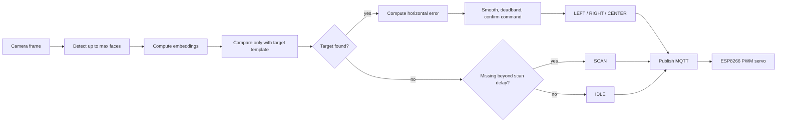

# MQTT Servo Face Tracking Addon

This addon runs the same face recognition and face-locking pipeline as the main app, then publishes MQTT messages for a servo-mounted ESP8266 camera and the browser dashboard. The live run is single-target: only the configured `--target-name` can lock and drive the servo.

The original `src/recognize.py` remains separate.

## Files

- `recognize_mqtt.py` - face recognition, face lock, MQTT movement commands, and dashboard status JSON.
- `esp8266/face_tracker_servo/face_tracker_servo.ino` - ESP8266 firmware that subscribes to movement commands.
- `esp8266/upload.ps1` - helper script for compiling and uploading with `arduino-cli`.
- `../../dashboard/index.html` - static MQTT dashboard.

## MQTT Topics

Default broker:

```text
broker.hivemq.com
```

Ports:

- `1883` - plain MQTT for Python and ESP8266.
- `8000` - MQTT over WebSockets for the browser dashboard (`/mqtt` path).

Movement topic:

```text
vision/Dieudonne/ne/movement
```

Movement payloads:

- `LEFT` - locked face is left of frame center.
- `RIGHT` - locked face is right of frame center.
- `CENTER` - locked face is centered; the servo holds its current angle.
- `SCAN` - locked face is missing, sweep the servo to reacquire the target.
- `IDLE` - no active face lock.

The firmware also accepts `HOME` for manual recentering; the Python tracker does not publish it automatically.

Dashboard status topic:

```text
vision/Dieudonne/ne/status
```

Status payload shape:

```json
{
  "timestamp": 1781190000.0,
  "movement": "LEFT",
  "error_x": -124.5,
  "locked": true,
  "target": "Dieudonne",
  "locked_face_found": true,
  "faces": 1,
  "confidence": 0.8231,
  "target_similarity": 0.8231,
  "target_distance": 0.1769,
  "fps": 18.7,
  "threshold": 0.4,
  "provider": "CPU"
}
```

## Python Setup

From the repo root:

```bash
pip install -r requirements.txt
```

The default dependency is `onnxruntime`, which runs on CPU. No GPU is required.

Run the addon:

```bash
python addons/mqtt_servo_tracking/recognize_mqtt.py
```

Optional flags:

```bash
python addons/mqtt_servo_tracking/recognize_mqtt.py --target-name Dieudonne --mqtt-broker broker.hivemq.com --mqtt-port 1883 --mqtt-topic vision/Dieudonne/ne/movement --mqtt-status-topic vision/Dieudonne/ne/status --camera-width 1280 --camera-height 720 --max-faces 5 --locked-max-faces 5 --detect-every 2 --recognize-every 3 --deadzone-px 80 --center-exit-hysteresis-px 30 --error-smooth-alpha 0.35 --command-hold-sec 0.25 --scan-delay-sec 0.8 --reacquire-hold-sec 0.30 --command-confirm-frames 2 --mqtt-min-interval 0.15 --mqtt-status-min-interval 0.25
```

Use `--disable-mqtt` to run the recognizer without publishing MQTT messages. Structured evidence logs are enabled by default and are written to `logs/evidence/`.

## Recognize To Command Flow



When locked, the tracker still evaluates several detected faces. Non-target faces can be visible, but only the configured `--target-name` is accepted for lock, reacquisition, and motor movement.

## Evidence Logs

Every run writes structured JSONL evidence to:

```text
logs/evidence/face_tracking_evidence_[timestamp].jsonl
```

Each record includes target name, timestamp, sequence number, face boxes, target confidence, distance, lock state, horizontal error, motor command, and MQTT publish result. Keep this file for assessment evidence together with the action history files in `logs/`.

## Dashboard

Open:

```text
dashboard/index.html
```

The dashboard connects directly to MQTT over WebSockets:

```text
ws://broker.hivemq.com:8000/mqtt
```

It subscribes to both the movement topic and the dashboard status topic. If your broker uses a different WebSocket port or path, change it in the dashboard input field and reconnect.

Plain MQTT port `1883` cannot be used directly by a browser.

The dashboard uses status JSON as the authoritative display state. Raw movement messages are only a fallback when status messages stop arriving, so delayed movement packets should not make the UI flicker.

## ESP8266 Setup

1. Open `esp8266/face_tracker_servo/face_tracker_servo.ino`.
2. Set:

   ```cpp
   const char* WIFI_SSID = "your-wifi";
   const char* WIFI_PASSWORD = "your-password";
   ```

3. Confirm the MQTT settings:

   ```cpp
   const char* MQTT_SERVER = "broker.hivemq.com";
   const uint16_t MQTT_PORT = 1883;
   const char* MQTT_TOPIC = "vision/Dieudonne/ne/movement";
   ```

4. Tune the servo constants:

   - `SERVO_PIN`
   - `SERVO_MIN_ANGLE`
   - `SERVO_MAX_ANGLE`
   - `SERVO_CENTER_ANGLE`
   - `SERVO_MIN_PULSE_US`
   - `SERVO_MAX_PULSE_US`
   - `TRACK_STEP`
   - `SCAN_STEP`
   - `REVERSE_SERVO`

5. Install Arduino libraries:

   - `PubSubClient`
   - `Servo` from the ESP8266 core

6. Upload:

   ```powershell
   powershell -ExecutionPolicy Bypass -File addons/mqtt_servo_tracking/esp8266/upload.ps1 -Port COM5
   ```

For a different ESP8266 board:

```powershell
powershell -ExecutionPolicy Bypass -File addons/mqtt_servo_tracking/esp8266/upload.ps1 -Port COM5 -Fqbn esp8266:esp8266:d1_mini
```

## Wiring, Power, And Safety

| Component | Connection |
| --- | --- |
| Servo signal | ESP8266 `D5` / GPIO14 |
| Servo V+ | Stable 5 V supply or board `VIN` if the supply can handle servo current |
| Servo GND | Common ground with ESP8266 GND |
| ESP8266 power | Micro-USB or regulated 5 V input |

- Use a common ground between the servo supply and ESP8266.
- Use an external 5 V supply if the servo jitters, browns out the board, or carries the camera load.
- Set servo angle limits before attaching the camera mount.
- Secure the base and servo slot before testing `SCAN`.
- Flip `REVERSE_SERVO` if the camera moves away from the target.

## Tuning

- Use `--profile` to show CPU timing for detection, recognition, and full frame time.
- Drop to `--camera-width 640 --camera-height 360` on CPU systems that cannot keep up with 1280x720.
- Increase `--detect-every` or `--recognize-every` to reduce CPU load.
- Keep `--locked-max-faces` above `1` when demonstrating multiple-face robustness.
- Increase `--deadzone-px` if the servo keeps moving near center.
- Increase `--command-hold-sec` if short command blips still show up.
- Increase `--center-exit-hysteresis-px` if the servo oscillates around center.
- Increase `--scan-delay-sec` if short recognition drops trigger `SCAN`.
- Increase `--command-confirm-frames` for steadier movement at the cost of slower response.
- Increase `--mqtt-min-interval` if too many repeated movement commands are sent.

## Troubleshooting

- Python publishes but ESP8266 does not move: check ESP Serial Monitor, Wi-Fi credentials, broker, topic, and servo wiring.
- Dashboard stays offline: confirm MQTT over WebSockets is enabled at `ws://broker.hivemq.com:8000/mqtt`.
- Recognizer is slow on CPU: lower camera resolution in `recognize_mqtt.py`.
- Known faces show as unknown: enroll more samples or increase the recognition threshold with `+`.
